# How to Generate Images in Python with Diffusion Models 

Hello everyone, today we are going to explain how to Load Diffusion models to generate images in Python.

Currently there are many types of models that can be used to generate images.

## Step 1:  Create the environment

In ordering to generate images from a text you requires a GPU , you can use your **local environment** or use a **cloud environment**

### Local  Environment

If you have  **Windows 11** and **Ubuntu 22.04** **wsl** and you have a good **Nvidia Graphics Card**  you can perform the following:

Open a Windows PowerShell 

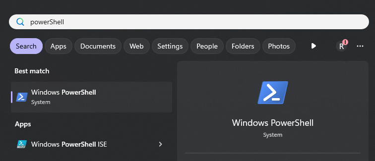

We ensure that the Windows Subsystem for Linux is running by opening PowerShell and running:

```
 wsl.exe --list --verbose
```

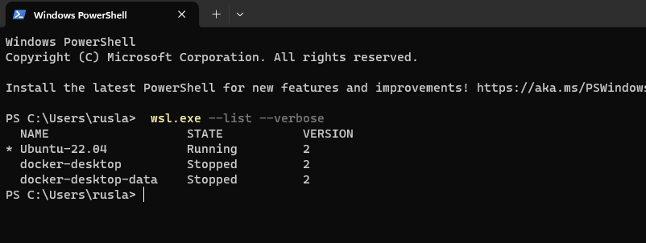

Then we create our folder where we are going to build this project, in my case I will work in a external drive  E:

You can your favorite drive, such as `E:`  and then type	

```
bash
```

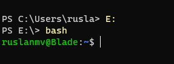

then we can create our project let us call `sd ` due to we remind it **Stable Diffusion Models**

```
mkdir sd
cd sd
```

First, we need to install Python on our computer, in this demo I will use **Python 3.10.** 

```
sudo apt-get install python3.10 python3-pip
```

 Create a symbolic link for `python3` to point to `python3.10`. Run the following command:

```
sudo ln -sf $(which python3.10) /usr/bin/python   
```

With Python already installed, you should have pip already installed. Be sure to use a pip that corresponds with Python 3 by using pip3 or checking your pip executable with 

```
pip --version
```

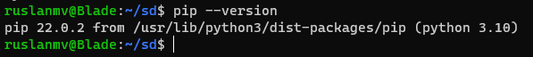

and now we are ready to start write our python environment.

## Cloud Environment

For the cloud environment we use **SageMaker**  from AWS [here](https://aws.amazon.com/marketplace/management/signin) we create a notebook instance with the `ml.g4dn.xlarge` with `50`gb volume size. 

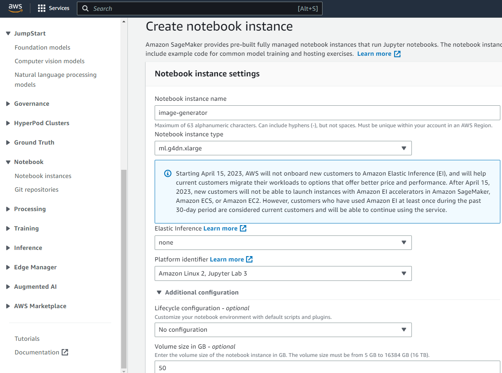

and then after you click on ` open Jupyter Lab`

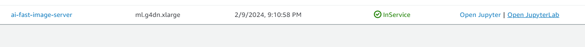

we go to the terminal

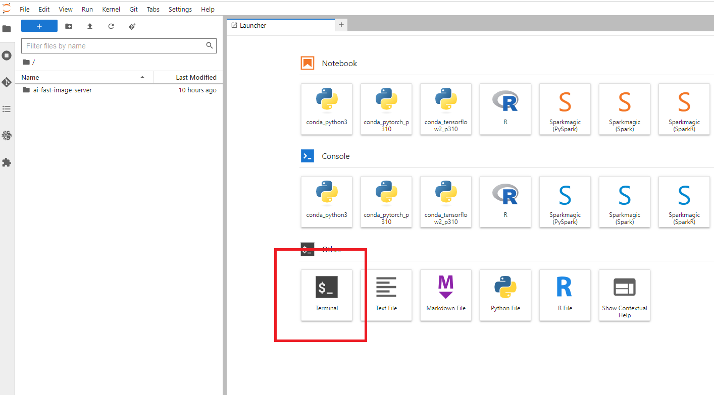

you type

```
source activate python3
```

```
cd SageMaker
mkdir sd
```

and now we are ready to create our python environment.

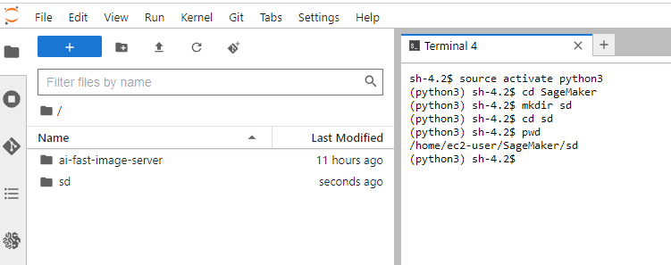

## Step 2: Create a Python virtual environment

A Python virtual environment allows one to use different versions of Python as well as isolate dependencies between projects. If you’ve never had several repos on your machine at once, you may never have felt this need but it’s a good, Pythonic choice nonetheless. Future you will thank us both!

Run the following command:

```
python  -m venv venv
```

You’ll notice a new directory in your current working directory with the same name as your virtual environment.

Activate the virtual environment.

```
source ./venv/bin/activate
```

In your local env you have

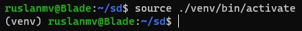

In the cloud env you have

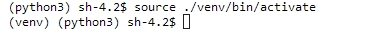

Now we are ready to install all the packages that we need .

## Step 3: Notebook Installation


For the local and cloud environments  we terminal type the following commands:

```
python -m pip install --upgrade pip
pip install ipykernel notebook ipywidgets
```

then

```
python -m ipykernel install --user --name sd --display-name "Python(sd)"
```

**For the local environment:**

You can install Jupyter lab

```
pip install jupyterlab
```

Now we can open our environment by typing 

```
jupyter lab
```

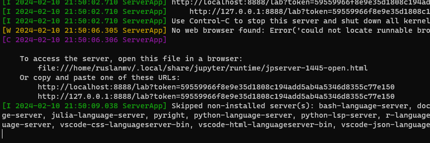

You should open your URL  in my case

  [http://localhost:8888/lab?token=59559966f8e9e35d1808c194add5ab4a5346d8355c77e150](  http://localhost:8888/lab?token=59559966f8e9e35d1808c194add5ab4a5346d8355c77e150)

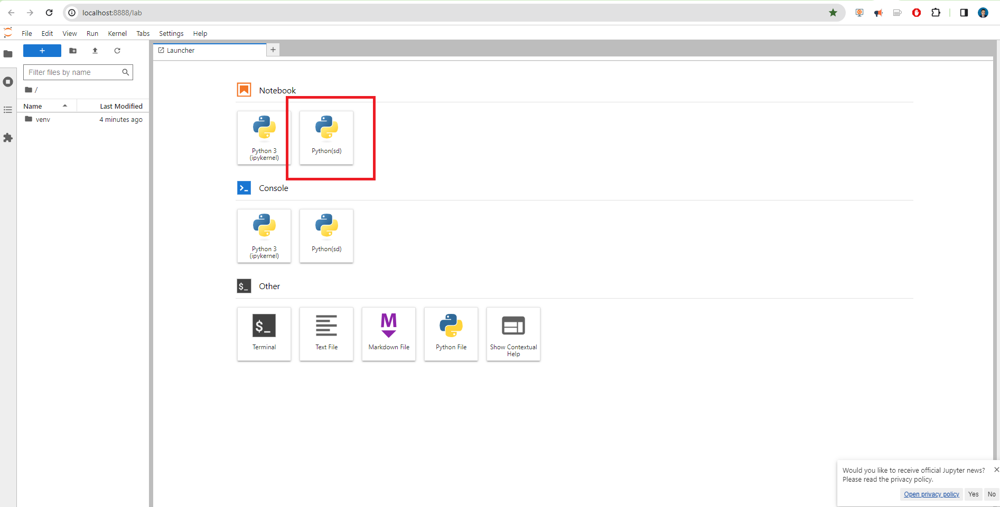

And you click **Python(sd)** and will be open our Jupyer notebook where we are going to work.

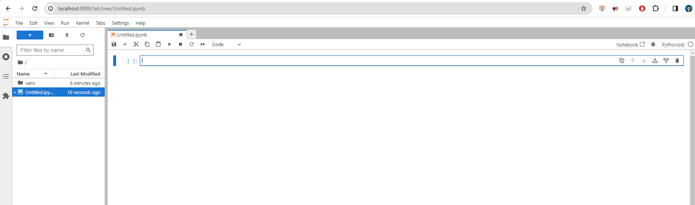

**For the cloud environment:**

We click File>New>Notebook

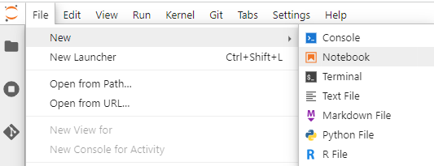

and we select just our environment created

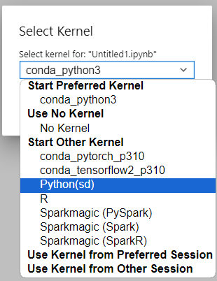

and we are ready to work.

## Step 4: Package Installation for Diffusion Models

First let us enter to the terminal and we install the libraries that we will use

```
source ./venv/bin/activate
pip install invisible_watermark transformers accelerate safetensors pandas xformers matplotlib
```

