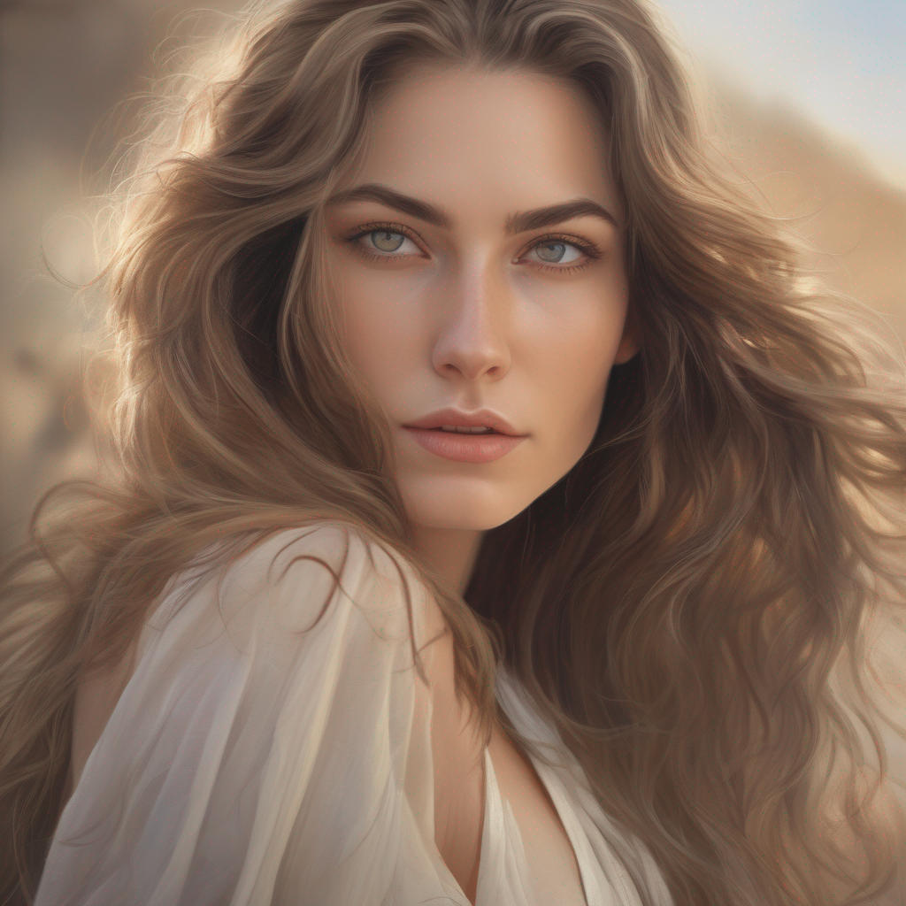
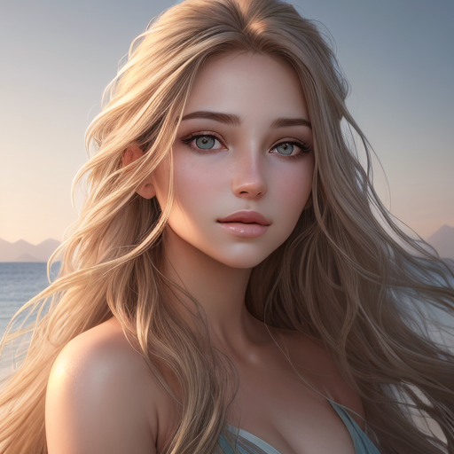
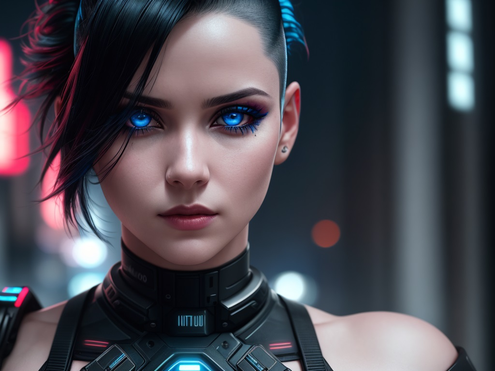
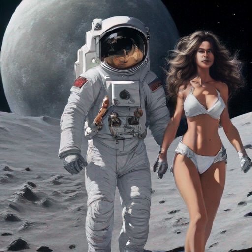
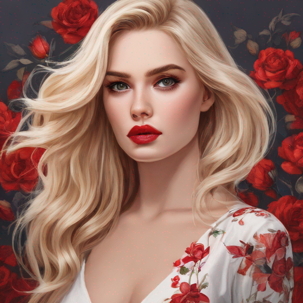
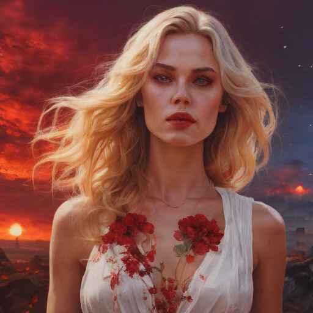
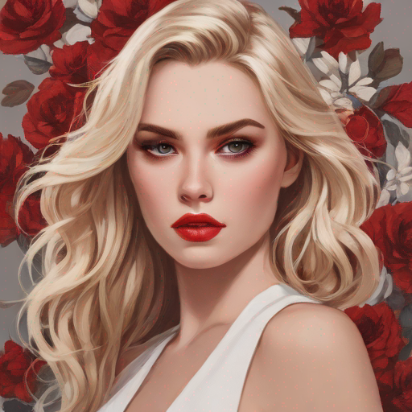
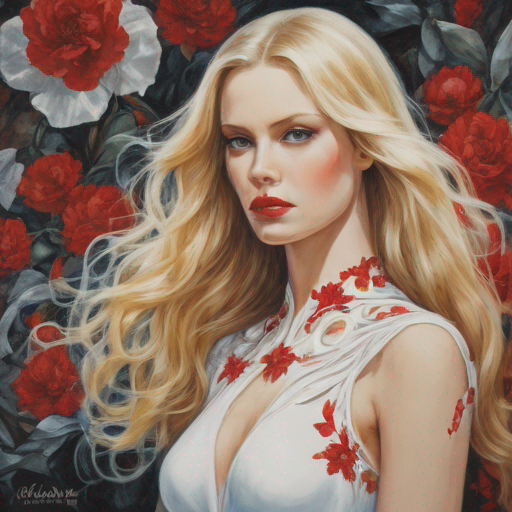

# How to Generate Images in Python with Diffusion Models

Hello everyone, today we are going to explain how to Load Diffusion models to generate images in Python.

Currently there are many types of models that can be used to generate images.

## Step 1:  Create the environment

In ordering to generate images from a text you requires a GPU , you can use your **local environment** or use a **cloud environment**

### Local  Environment

If you have  **Windows 11** and **Ubuntu 22.04** **wsl** and you have a good **Nvidia Graphics Card**  you can perform the following:

Open a Windows PowerShell


We ensure that the Windows Subsystem for Linux is running by opening PowerShell and running:

```
 wsl.exe --list --verbose
```


Then we create our folder where we are going to build this project, in my case I will work in a external drive  E:

You can your favorite drive, such as `E:`  and then type

```
bash
```


then we can create our project let us call `sd ` due to we remind it **Stable Diffusion Models**

```
mkdir sd
cd sd
```

First, we need to install Python on our computer, in this demo I will use **Python 3.10.**

```
sudo apt-get install python3.10 python3-pip
```

 Create a symbolic link for `python3` to point to `python3.10`. Run the following command:

```
sudo ln -sf $(which python3.10) /usr/bin/python   
```

With Python already installed, you should have pip already installed. Be sure to use a pip that corresponds with Python 3 by using pip3 or checking your pip executable with

```
pip --version
```


and now we are ready to start write our python environment.

## Cloud Environment

For the cloud environment we use **SageMaker**  from AWS [here](https://aws.amazon.com/marketplace/management/signin) we create a notebook instance with the `ml.g4dn.xlarge` with `50`gb volume size.


and then after you click on ` open Jupyter Lab`


we go to the terminal


you type

```
source activate python3
```

```
cd SageMaker
mkdir sd
```

and now we are ready to create our python environment.


## Step 2: Create a Python virtual environment

A Python virtual environment allows one to use different versions of Python as well as isolate dependencies between projects. If you’ve never had several repos on your machine at once, you may never have felt this need but it’s a good, Pythonic choice nonetheless. Future you will thank us both!

Run the following command:

```
python  -m venv venv
```

You’ll notice a new directory in your current working directory with the same name as your virtual environment.

Activate the virtual environment.

```
source ./venv/bin/activate
```

In your local env you have


In the cloud env you have


Now we are ready to install all the packages that we need .

## Step 3: Notebook Installation


For the local and cloud environments  we terminal type the following commands:

```
python -m pip install --upgrade pip
pip install ipykernel notebook ipywidgets
```

then

```
python -m ipykernel install --user --name sd --display-name "Python(sd)"
```

**For the local environment:**

You can install Jupyter lab

```
pip install jupyterlab
```

Now we can open our environment by typing

```
jupyter lab
```


You should open your URL  in my case

  [http://localhost:8888/lab?token=59559966f8e9e35d1808c194add5ab4a5346d8355c77e150](  http://localhost:8888/lab?token=59559966f8e9e35d1808c194add5ab4a5346d8355c77e150)


And you click **Python(sd)** and will be open our Jupyer notebook where we are going to work.


**For the cloud environment:**

We click File>New>Notebook


and we select just our environment created


and we are ready to work.

## Step 4: Package Installation for Diffusion Models

First let us enter to the terminal and we install the libraries that we will use

```
source ./venv/bin/activate
pip install invisible_watermark transformers accelerate safetensors pandas xformers matplotlib
```

## Step 5 . Diffusion Models for Image Generation

In this notebook, we will explore the fascinating world of diffusion models and their capability to generate images. We will dive into the workings of several popular diffusion models, gaining insights into their unique features and applications. By the end of this notebook, you will have a comprehensive understanding of diffusion models and be familiar with the following models:

- **Stable diffusion xl base 1.0**

- **DreamShaper 7**

- **SDXL-Turbo**

- **Dreamshaper xl v2 turbo**


Get started on this journey as we uncover the principles behind these diffusion models and witness their remarkable image generation capabilities.

## Checking System Requirements

In order to run this notebook we requires a GPU


```python
import os
import sys
# Use GPU
gpu_info = os.popen('nvidia-smi').read()
if 'failed' in gpu_info:
    print('Not connected to a GPU')
    is_gpu = False
else:
    print(gpu_info)
    is_gpu = True
print(is_gpu)

print("Python version:", sys.version)
print("Python executable path:", sys.executable)
```

    Sun Feb 11 16:39:59 2024       
    +---------------------------------------------------------------------------------------+
    | NVIDIA-SMI 535.104.12             Driver Version: 535.104.12   CUDA Version: 12.2     |
    |-----------------------------------------+----------------------+----------------------+
    | GPU  Name                 Persistence-M | Bus-Id        Disp.A | Volatile Uncorr. ECC |
    | Fan  Temp   Perf          Pwr:Usage/Cap |         Memory-Usage | GPU-Util  Compute M. |
    |                                         |                      |               MIG M. |
    |=========================================+======================+======================|
    |   0  Tesla T4                       On  | 00000000:00:1E.0 Off |                    0 |
    | N/A   24C    P8               8W /  70W |      0MiB / 15360MiB |      0%      Default |
    |                                         |                      |                  N/A |
    +-----------------------------------------+----------------------+----------------------+
    
    +---------------------------------------------------------------------------------------+
    | Processes:                                                                            |
    |  GPU   GI   CI        PID   Type   Process name                            GPU Memory |
    |        ID   ID                                                             Usage      |
    |=======================================================================================|
    |  No running processes found                                                           |
    +---------------------------------------------------------------------------------------+
    
    True
    Python version: 3.10.13 | packaged by conda-forge | (main, Oct 26 2023, 18:07:37) [GCC 12.3.0]
    Python executable path: /home/ec2-user/SageMaker/sd/venv/bin/python


```python
prompt5= "An ultra-detailed and true-to-life image of a beautiful woman with an enchanting aura, mesmerizing eyes, and a gentle smile, complemented by a dreamy and artistic background."
```

## Stable diffusion XL base 1.0

The world of AI-powered image generation has taken a leap forward with the arrival of Stable Diffusion XL, or stable-diffusion-xl-base-1.0. This isn't just another text-to-image model; it's a groundbreaking ensemble of experts, meticulously orchestrated to translate your textual whims into stunning visuals. But beneath the artistic facade lies a complex, two-stage pipeline employing innovative techniques like latent diffusion.


### Step 1 - Packages Installation


```python
from IPython.display import clear_output
os.system("pip install diffusers --upgrade")
os.system("pip install invisible_watermark transformers accelerate safetensors")
# Clear the output
clear_output()
```

The stable-diffusion-xl-base-1.0 is an ensemble of experts pipeline for latent diffusion. It consists of a base model that generates (noisy) latents, which are then refined using a separate refinement model specialized for denoising.


```python
# Get the current directory
import os
current_dir = os.getcwd()
model_path = os.path.join(current_dir)
# Set the cache path
cache_path = os.path.join(current_dir, "cache")
```

To just use the base model, you can run:


```python
cache_path
```


    '/home/ec2-user/SageMaker/sd/cache'


```python
from diffusers import DiffusionPipeline
import torch

pipe = DiffusionPipeline.from_pretrained("stabilityai/stable-diffusion-xl-base-1.0",
                                         torch_dtype=torch.float16,
                                         use_safetensors=True, variant="fp16",
                                        cache_dir=cache_path)
pipe.to("cuda")
clear_output()
```


```python
prompt= "An ultra-realistic portrait of a beautiful woman with flowing hair, radiant skin, and captivating eyes, set against a serene backdrop."
images = pipe(prompt=prompt).images[0]
from IPython.display import display
# Display the image in the Jupyter Notebook
display(images)
images.save("./image1.png")
```





To generate a higher quality image with 1024x768 resolution, you can modify the payload


```python
from diffusers import DiffusionPipeline
import torch

pipe = DiffusionPipeline.from_pretrained("stabilityai/stable-diffusion-xl-base-1.0",
                                         torch_dtype=torch.float16,
                                         use_safetensors=True, variant="fp16",
                                        cache_dir=cache_path)
pipe.to("cuda")
clear_output()
```

```python
# Set the seed for reproducibility
seed = 42
torch.manual_seed(seed)
np.random.seed(seed)
random.seed(seed)
```


```python
# Load and customize payload
payload = json.loads(json.dumps({
    "model_id": 'stabilityai/stable-diffusion-xl-base-1.0',
    "prompt": "An ultra-realistic portrait of a beautiful woman with flowing hair, radiant skin, and captivating eyes, set against a serene backdrop.",
    #"negative_prompt": "painting, extra fingers, mutated hands, poorly drawn hands, poorly drawn face, deformed, ugly, blurry, bad anatomy, bad proportions, extra limbs, cloned face, skinny, glitchy, double torso, extra arms, extra hands, mangled fingers, missing lips, ugly face, distorted face, extra legs, anime",
    "width": 1024,  # Set desired image width
    "height": 768,   # Set desired image height
    "samples": 1,
    "num_inference_steps": 30,  # Increase steps for higher quality (might take longer)
    "safety_checker": "no",
    "enhance_prompt": "yes",
    "guidance_scale": 6.5,  # Optionally add # Control detail level (higher = sharper)
    "seed": 2,  # Keep None for random results
    "multi_lingual": "no",
    "panorama": "no",
    "self_attention": "no",
    "upscale": "no",
}))
# Generate image with adjusted settings
images = pipe(**payload).images[0]

# Display and save image
from IPython.display import display
display(images)
images.save("./image1.png")
```


## dreamshaper-7

lykon/dreamshaper-7 is a Stable Diffusion model that has been fine-tuned on runwayml/stable-diffusion-v1-5.


```python
from diffusers import AutoPipelineForText2Image, DEISMultistepScheduler
import torch

pipe = AutoPipelineForText2Image.from_pretrained('lykon/dreamshaper-7', torch_dtype=torch.float16, variant="fp16")
pipe.scheduler = DEISMultistepScheduler.from_config(pipe.scheduler.config)
pipe = pipe.to("cuda")
clear_output()
prompt= "An ultra-realistic portrait of a beautiful woman with flowing hair, radiant skin, and captivating eyes, set against a serene backdrop."
generator = torch.manual_seed(363)
image = pipe(prompt, generator=generator, num_inference_steps=25).images[0]  
image.save("./image3.png")
```

```python
display(image)

```


​    

```python
To generate a higher quality image with 1024x768 resolution, you can modify the payload and use the `AutoPipelineForText2Image` class instead of `DiffusionPipeline`. 
```


```python
from diffusers import AutoPipelineForText2Image, DEISMultistepScheduler
import torch
from IPython.display import display, clear_output

cache_path = os.path.join(current_dir, "cache")
pipe = AutoPipelineForText2Image.from_pretrained("lykon/dreamshaper-7",
                                                 torch_dtype=torch.float16,
                                                 variant="fp16",
                                                 cache_dir=cache_path)
pipe.scheduler = DEISMultistepScheduler.from_config(pipe.scheduler.config)
pipe = pipe.to("cuda")

prompt = "An ultra-realistic portrait of a beautiful woman with flowing hair, radiant skin, and captivating eyes, set against a serene backdrop."

# Create a payload with desired settings
payload = {
    "negative_prompt": "two faces",
    "width": 1024,
    "height": 768,
    "samples": 1,
    "num_inference_steps": 50,  # Increase the number of inference steps for better quality
    "enhance_prompt": "yes",
    "seed": 1,
    "guidance_scale": 7.5,
}

generator = torch.manual_seed(payload['seed']) if payload['seed'] is not None else None
image = pipe(prompt,
             generator=generator,
             num_inference_steps=payload["num_inference_steps"],
             resize_method="aspect",
             width=payload["width"],
             height=payload["height"]).images[0]

clear_output()
```


```python
# Display the image in the Jupyter Notebook
display(image)
image.save("./image-ultra.png")
```


```python
import json
import torch
from diffusers import AutoPipelineForText2Image, DEISMultistepScheduler

payload = json.loads(json.dumps({  
    "model_id": 'lykon/dreamshaper-7',
    "prompt": "ultra realistic close up portrait ((beautiful pale cyberpunk female with heavy black eyeliner)), blue eyes, shaved side haircut, hyper detail, cinematic lighting, magic neon, dark red city, Canon EOS R3, nikon, f/1.4, ISO 200, 1/160s, 8K, RAW, unedited, symmetrical balance, in-frame, 8K",
    "negative_prompt": "painting, extra fingers, mutated hands, poorly drawn hands, poorly drawn face, deformed, ugly, blurry, bad anatomy, bad proportions, extra limbs, cloned face, skinny, glitchy, double torso, extra arms, extra hands, mangled fingers, missing lips, ugly face, distorted face, extra legs, anime",
    "width": 1024,
    "height": 768,
    "samples": "1",
    "num_inference_steps": "30",
    "safety_checker": "no",
    "enhance_prompt": "yes",
    "seed": None,
    "guidance_scale": 7.5,
    "multi_lingual": "no",
    "panorama": "no",
    "self_attention": "no",
    "upscale": "no",
    "seed":5
}))

pipe = AutoPipelineForText2Image.from_pretrained(payload['model_id'], torch_dtype=torch.float16, variant="fp16")
pipe.scheduler = DEISMultistepScheduler.from_config(pipe.scheduler.config)
pipe = pipe.to("cuda")
#clear_output()
prompt = payload['prompt']
negative_prompt = payload['negative_prompt']
num_inference_steps = int(payload['num_inference_steps'])

generator = torch.manual_seed(payload['seed']) if payload['seed'] is not None else None
image = pipe(prompt, 
             negative_prompt=negative_prompt, 
             generator=generator,
             num_inference_steps=num_inference_steps,
             resize_method="aspect",
             width=payload["width"],
             height=payload["height"]).images[0]
image.save("./imageN.png")

```

```
display(image)
```




## SDXL-Turbo

Imagine creating high-quality images from text descriptions in an instant, without waiting for long processing times. That's the magic of SDXL-Turbo, a powerful text-to-image model fueled by a cutting-edge technique called Adversarial Diffusion Distillation (ADD).

SDXL-Turbo is like a "lite" version of its bigger brother, SDXL 1.0. It has learned and compressed all the image-making knowledge of the original model, but in a smaller, faster package.

Additional benefits:

- Reduced computational cost: Smaller model size means less processing power needed, making it more accessible for personal use or on devices with limited resources.
- Faster experimentation: Trying out different prompts and ideas becomes quicker and easier, opening up new creative possibilities.
  However, keep in mind:
- Trade-offs are inevitable: While fast and efficient, SDXL-Turbo might not always match the detailed quality of larger models in complex scenarios.
  Still under development: This is an evolving technology, and further improvements are expected in the future.

Text-to-image:
SDXL-Turbo does not make use of guidance_scale or negative_prompt, we disable it with guidance_scale=0.0. Preferably, the model generates images of size 512x512 but higher image sizes work as well. A single step is enough to generate high quality images.


```python
from IPython.display import clear_output
os.system("pip install diffusers transformers accelerate --upgrade")
clear_output()

```

```python
# Set the seed for reproducibility
seed = 42
torch.manual_seed(seed)
np.random.seed(seed)
random.seed(seed)
```


```python
from diffusers import AutoPipelineForText2Image
import torch
pipe = AutoPipelineForText2Image.from_pretrained("stabilityai/sdxl-turbo",
                                                 torch_dtype=torch.float16,
                                                 variant="fp16",
                                                cache_dir=cache_path)
pipe.to("cuda")

clear_output()

```


```python
prompt= "astronaut with spacesuit walking in the moon with a beutiful woman in bikini with flowing hair, radiant skin, and captivating eyes."
image = pipe(prompt=prompt, num_inference_steps=2, guidance_scale=1.0, seed=10).images[0]
```

```python
from IPython.display import display
# Display the image in the Jupyter Notebook
display(image)
image.save("./image3.png")
```



​    


## dreamshaper-xl-v2-turbo


```python
os.system("pip install diffusers transformers accelerate")
clear_output()
```


```python
from diffusers import AutoPipelineForText2Image, DPMSolverMultistepScheduler
import torch

pipe = AutoPipelineForText2Image.from_pretrained('lykon/dreamshaper-xl-v2-turbo', torch_dtype=torch.float16, variant="fp16",cache_dir=cache_path)
pipe.scheduler = DPMSolverMultistepScheduler.from_config(pipe.scheduler.config)
pipe = pipe.to("cuda")
```

```python
prompt= "astronaut with spacesuit walking in the moon with a beutiful woman in bikini with flowing hair, radiant skin, and captivating eyes."
generator = torch.manual_seed(10)
image = pipe(prompt, num_inference_steps=20, guidance_scale=2).images[0]  
```

```python
# Display the image in the Jupyter Notebook
display(image)
image.save("./image.png")
```


.png)
​    

# Generation of Multiple Images


Let us create a program that generates  multiple pictures by adding some descriptions and the program augmented the description by using an small GPT model.


```python
images_path = os.path.join(current_dir, "images")
df_path = os.path.join(current_dir, "images","collection.csv")
```


```python
import os
import torch
import numpy as np
import pandas as pd
from diffusers import DiffusionPipeline
from transformers import pipeline
from PIL import Image
from tqdm import tqdm
import random
from IPython.display import clear_output
pipe = pipeline('text-generation', model='daspartho/prompt-extend')

def extend_prompt(prompt):
    return pipe(prompt+',', num_return_sequences=1)[0]["generated_text"]

def text_it(inputs):
    return extend_prompt(inputs)

def load_pipeline(use_cuda):
    device = "cuda" if use_cuda and torch.cuda.is_available() else "cpu"
    if device == "cuda":
        torch.cuda.max_memory_allocated(device=device)
        torch.cuda.empty_cache()
        pipe = DiffusionPipeline.from_pretrained("stabilityai/sdxl-turbo", torch_dtype=torch.float16, variant="fp16", use_safetensors=True,cache_dir=cache_path)
        pipe.enable_xformers_memory_efficient_attention()
        pipe = pipe.to(device)
        torch.cuda.empty_cache()
    else:
        pipe = DiffusionPipeline.from_pretrained("stabilityai/sdxl-turbo", use_safetensors=True,cache_dir=cache_path )
        pipe = pipe.to(device)
    return pipe

def genie(prompt="sexy woman", steps=2, seed=0, use_cuda=False):
    pipe = load_pipeline(use_cuda)
    generator = np.random.seed(0) if seed == 0 else torch.manual_seed(seed)
    extended_prompt = extend_prompt(prompt)
    int_image = pipe(prompt=extended_prompt, generator=generator, num_inference_steps=steps, guidance_scale=0.0).images[0]
    return int_image, extended_prompt

from tqdm import tqdm

def save_images(prompt="sexy woman", steps=2, use_cuda=False, num_images=1000, folder=images_path, input_seed=0):
    if not os.path.exists(folder):
        os.makedirs(folder)

    data = []
    columns = ['Image','Prompt', 'Extended_Prompt', 'Steps', 'Seed','Path']
    df = pd.DataFrame(columns=columns)
    df.to_csv(df_path, index=False)

    for i in tqdm(range(num_images), desc="Generating Images"):
        seed = random.randint(1, 999999999999999999) if input_seed == 0 else input_seed
        int_image, extended_prompt = genie(prompt=prompt, steps=steps, seed=seed, use_cuda=use_cuda)
        image_filename = f"image_{i+1}.png"
        file_path=f"{folder}/{image_filename}"
        int_image.save(file_path)
        new_data = [image_filename,prompt, extended_prompt, steps, seed,file_path]
        data.append(new_data)
        # Update the DataFrame and save it to the CSV file
        df = pd.DataFrame(data, columns=columns)
        df.to_csv(df_path, index=False)
        clear_output()


```


```python
# Call the save_images function to generate and save 1000 images
prompt='''sexy woman,  flowing blonde hair, white dress with a red floral pattern, has red lipstick , serious expression.
'''
save_images(prompt=prompt, steps=2, use_cuda=True, num_images=10, folder=images_path)
```


```python
df = pd.read_csv(df_path)
```


```python
import pandas as pd
import matplotlib.pyplot as plt
from IPython.display import HTML
from PIL import Image
from io import BytesIO
import base64

# Read DataFrame
df_path = os.path.join(current_dir, "images","collection.csv")
df = pd.read_csv(df_path)

# Function to display image in Jupyter Notebook
def display_image(path):
    with open(path, 'rb') as f:
        img = Image.open(f)
        buffer = BytesIO()
        img.save(buffer, format='PNG')
        img_str = base64.b64encode(buffer.getvalue()).decode()
    return f''

# Display images and texts in a 2x5 table
image_paths = df['Path'].tolist()
extended_prompts = df['Extended_Prompt'].tolist()
table = '<table>'
for i in range(5):
    table += '<tr>'
    for j in range(2):
        img_path = image_paths[i*2 + j]
        extended_prompt = extended_prompts[i*2 + j]
        table += f'<td>{display_image(img_path)}<br>{extended_prompt}</td>'
    table += '</tr>'
table += '</table>'

HTML(table)
```

| Image                                                        | Image                                                        |
| ------------------------------------------------------------ | ------------------------------------------------------------ |
| <br><sub>sexy woman, flowing blonde hair, white dress with a red floral pattern, has red lipstick, serious expression. , portrait, studio portrait, fantasy, detailed illustration, hd, 4k, digital art, overdetailed art, concept art, by</sub> | <br><sub>sexy woman, flowing blonde hair, white dress with a red floral pattern, has red lipstick, serious expression. , background is a red sunset on fire, background of outer space by Beksinski, wojtek fus, Hiroshi Yoshida and Magic the Gathering.</sub> |
| <br><sub>sexy woman, flowing blonde hair, white dress with a red floral pattern, has red lipstick, serious expression.</sub> | <br><sub>sexy woman, flowing blonde hair, white dress with a red floral pattern, has red lipstick, serious expression. , sci-fi fantasy painting by Peter Andrew Jones, Jean Delville, Yoshitaka Amano, horizontally symmetrical shoulders, detailed, beautiful portrait,</sub> |

You can play with this program [here](https://huggingface.co/spaces/ruslanmv/Text-to-Multiple-Images-SDXL) in Hugging Face

**Congratulations!** You have practiced how to load  diffusion models and generate images in python.


