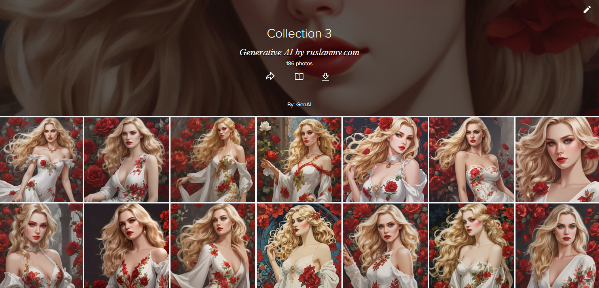

# Collection of Images Generated by Diffusion Models

In this folder we have created a python code 

[collection.py](./collection.py)  or notebook [collection.ipynb](./collection.ipynb)  

where generates a collection of pictures by using  stabilityai/sdxl-turbo model.

We have created some collections like this [collection3.csv](./collection3.csv) , [collection6.csv](./collection6.csv)  , [collection1.csv](./collection1.csv) .

